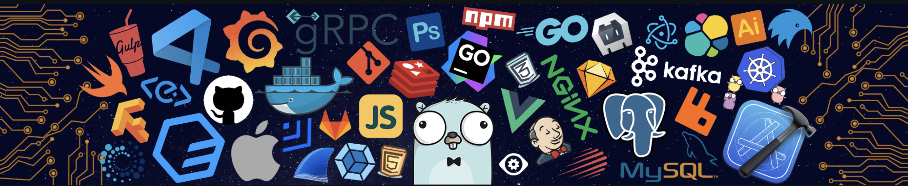

<table align = "center">
  <tr>
    <td width="50%">
      <h1 align="center">Hi 👋, I'm Jeevan Ghimire</h1>
      <h3 align="center">A passionate developer from Nepal (🇳🇵)</h3>
      

        
      

    </td>
    <td width="50%">
      
    </td>
  </tr>
</table>

<h3 align="left">Connect with me:</h3>

<h3 align="left">Languages and Tools:</h3>

                    

<h3 align="left">Support:</h3>

  

 
